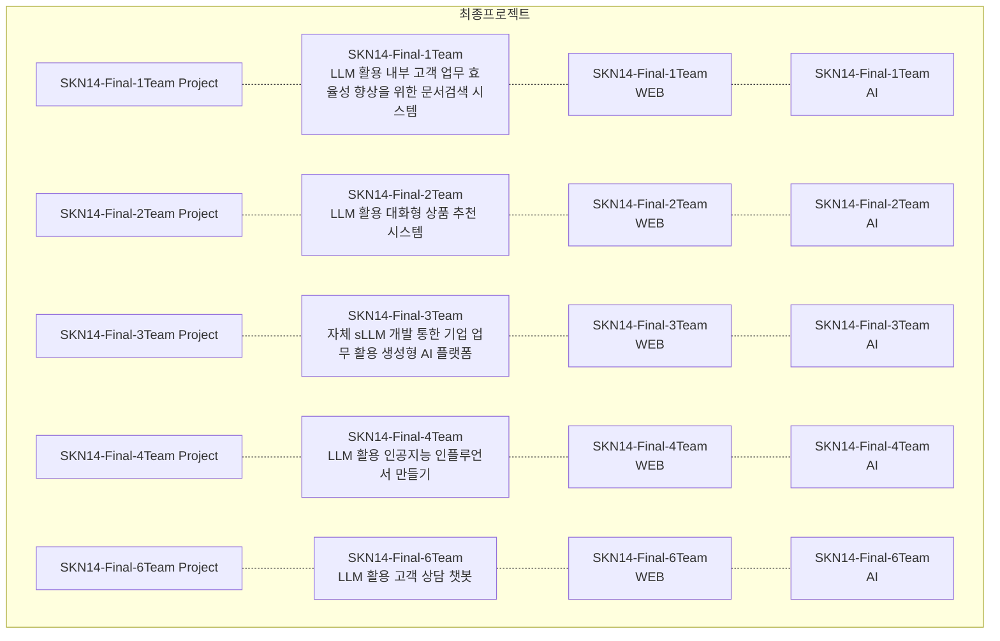
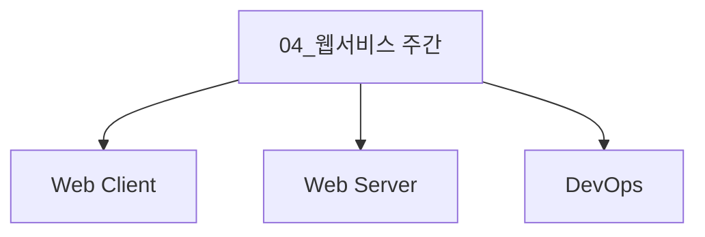
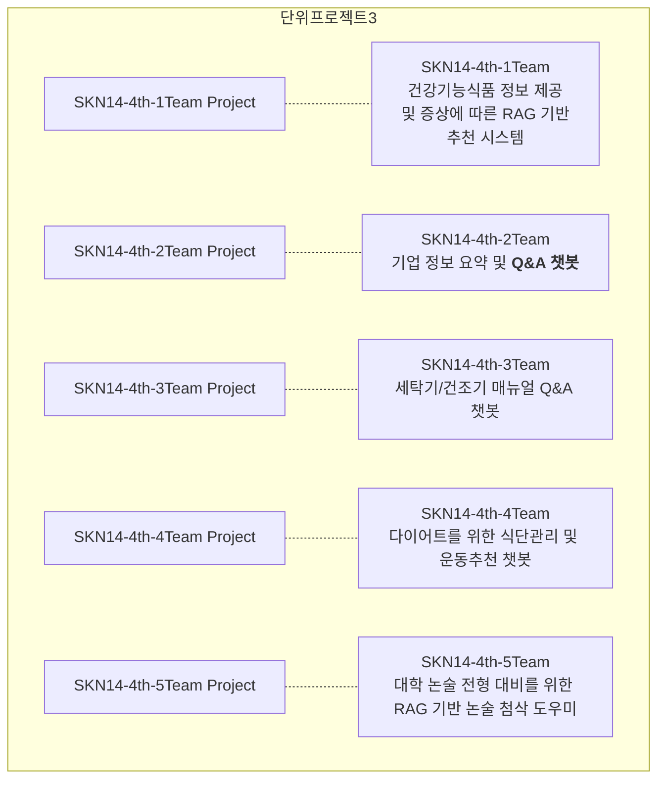
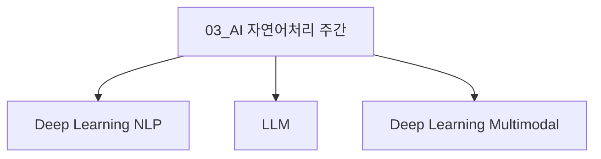
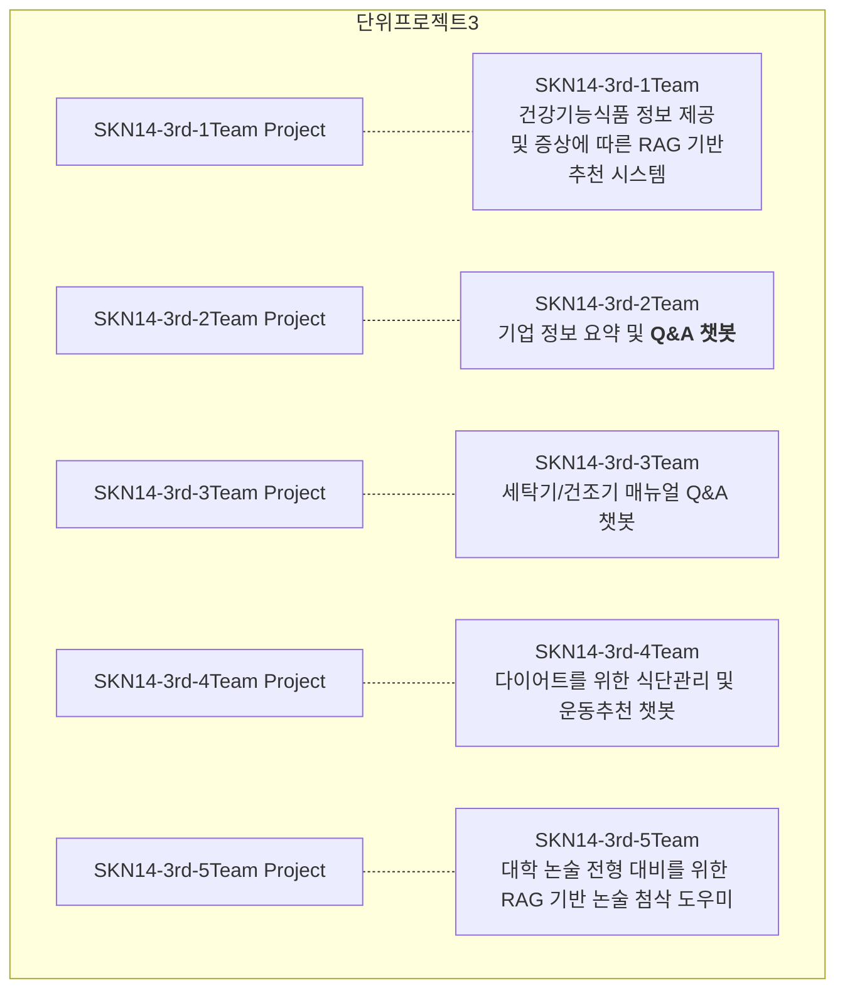
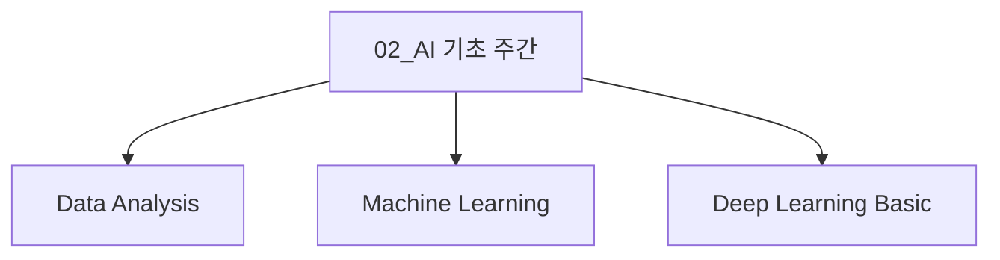
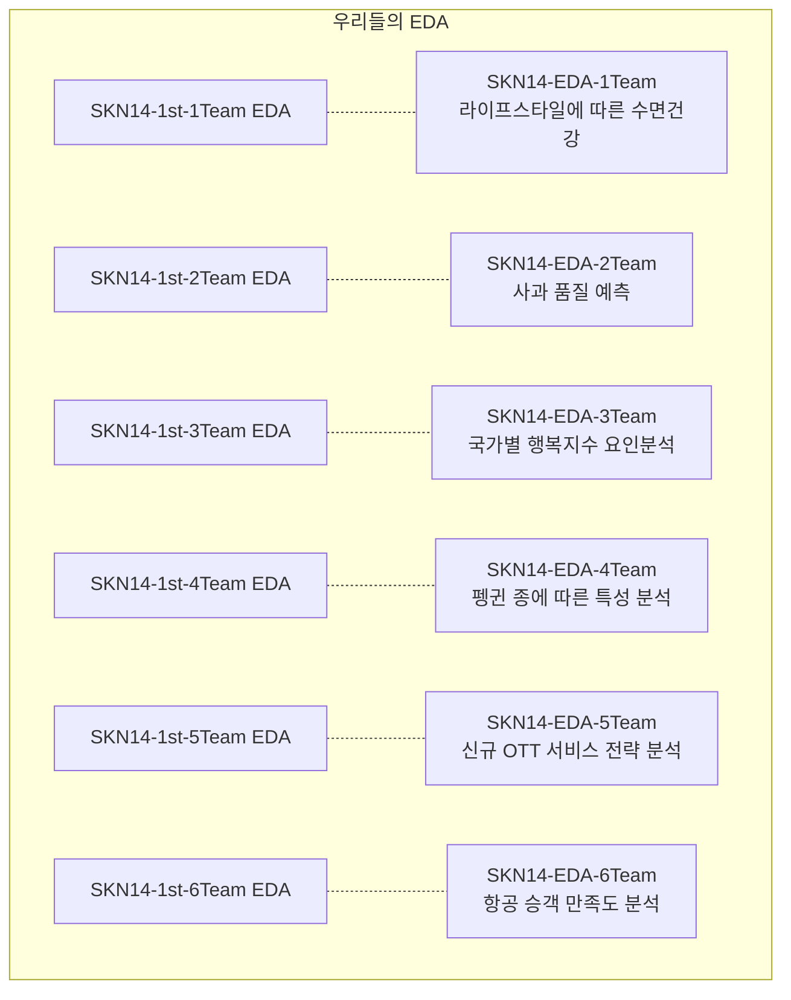
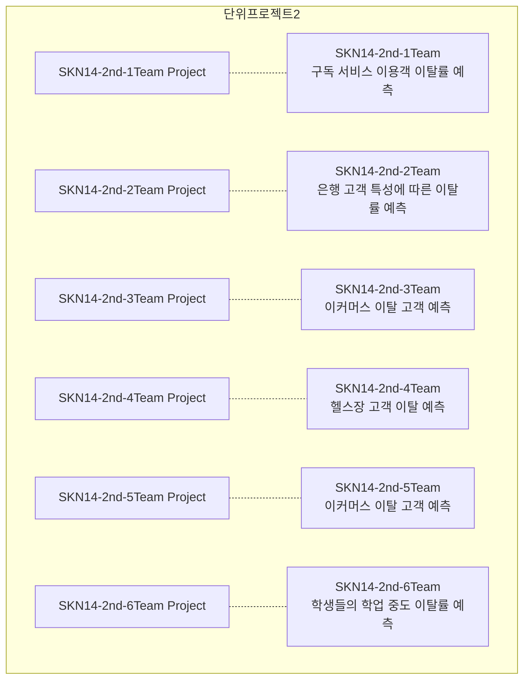
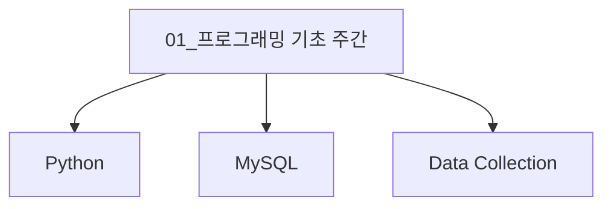
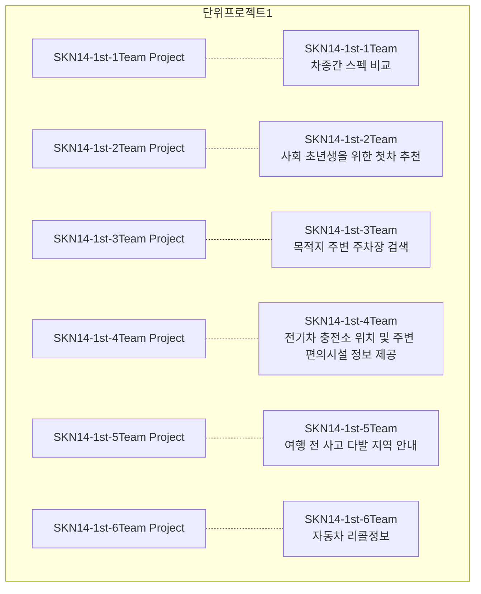

## 👋 SK네트웍스 Family AI 캠프 14기 👋

<!--

**Here are some ideas to get you started:**

🙋‍♀️ A short introduction - what is your organization all about?
🌈 Contribution guidelines - how can the community get involved?
👩‍💻 Useful resources - where can the community find your docs? Is there anything else the community should know?
🍿 Fun facts - what does your team eat for breakfast?
🧙 Remember, you can do mighty things with the power of [Markdown](https://docs.github.com/github/writing-on-github/getting-started-with-writing-and-formatting-on-github/basic-writing-and-formatting-syntax)
-->

## 프로젝트 소스코드 저장소 

### [05_최종프로젝트](https://github.com/orgs/skn-ai14-250409/projects/72) 

## 강의 소스코드 저장소 

### [04_웹서비스 주간](https://github.com/orgs/skn-ai14-250409/projects/56) 

###### [단위프로젝트4] _LLM 을 연동한 내외부 문서 기반 질의 응답 웹페이지 개발_

### [03_AI 자연어처리 주간](https://github.com/orgs/skn-ai14-250409/projects/30) 

###### [단위프로젝트3] _LLM 연동 내외부 문서 기반 질의 응답 시스템_

### [02_AI 기초 주간](https://github.com/orgs/skn-ai14-250409/projects/30) 

###### 우리들의 EDA

###### [단위프로젝트2] _가입 고객 이탈 예측_

### [01_프로그래밍 기초 주간](https://github.com/orgs/skn-ai14-250409/projects/1)

###### [단위프로젝트1] _전국 자동차 등록 현황 및 기업 FAQ 조회시스템_

