## 👋 SK네트웍스 Family AI 캠프 14기 👋

<!--

**Here are some ideas to get you started:**

🙋‍♀️ A short introduction - what is your organization all about?
🌈 Contribution guidelines - how can the community get involved?
👩‍💻 Useful resources - where can the community find your docs? Is there anything else the community should know?
🍿 Fun facts - what does your team eat for breakfast?
🧙 Remember, you can do mighty things with the power of [Markdown](https://docs.github.com/github/writing-on-github/getting-started-with-writing-and-formatting-on-github/basic-writing-and-formatting-syntax)
-->


## 강의 소스코드 저장소 

```mermaid
graph TD
    A[02_AI 기초 주간]
    A1[Data Analysis]
    A2[Machine Learning]
    A3[Deep Learning Basic]
    A --> A1
    A --> A2
    A --> A3

    click A "https://github.com/orgs/skn-ai14-250409/projects/30" "AI 기초"
    click A1 "https://github.com/skn-ai14-250409/data_analysis_workspace" "AI 기초 - Data Analysis"
    click A2 "https://github.com/skn-ai14-250409/machine_learning_workspace" "AI 기초 - Machine Learning"
    click A3 "https://github.com/skn-ai14-250409/deep_learning_basic_workspace" "AI 기초 - Deep Learning Basic"

```

### [02_AI 기초 주간](https://github.com/orgs/skn-ai14-250409/projects/30) 


###### 우리들의 EDA

```mermaid
graph TD
    
    subgraph 우리들의 EDA
        A1[SKN14-1st-1Team EDA]
        A2[SKN14-1st-2Team EDA]
        A3[SKN14-1st-3Team EDA]
        A4[SKN14-1st-4Team EDA]
        A5[SKN14-1st-5Team EDA]
        A6[SKN14-1st-6Team EDA]

        %% B1["SKN14-1st-1Team<br><sub>세부내용</sub>"]
        B1[SKN14-EDA-1Team<br>라이프스타일에 따른 수면건강]
        B2[SKN14-EDA-2Team<br>사과 품질 예측]
        B3[SKN14-EDA-3Team<br>국가별 행복지수 요인분석]
        B4[SKN14-EDA-4Team<br>펭귄 종에 따른 특성 분석]
        B5[SKN14-EDA-5Team<br>신규 OTT 서비스 전략 분석]
        B6[SKN14-EDA-6Team<br>항공 승객 만족도 분석]

        A1 -.- B1
        A2 -.- B2
        A3 -.- B3
        A4 -.- B4
        A5 -.- B5
        A6 -.- B6

            

    end
    click A1 "https://github.com/orgs/skn-ai14-250409/projects/32" "SKN14-EDA-1Team"
    click A2 "https://github.com/orgs/skn-ai14-250409/projects/33" "SKN14-EDA-2Team"
    click A3 "https://github.com/orgs/skn-ai14-250409/projects/34" "SKN14-EDA-3Team"
    click A4 "https://github.com/orgs/skn-ai14-250409/projects/35" "SKN14-EDA-4Team"
    click A5 "https://github.com/orgs/skn-ai14-250409/projects/36" "SKN14-EDA-5Team"
    click A6 "https://github.com/orgs/skn-ai14-250409/projects/37" "SKN14-EDA-6Team"

    click B1 "https://github.com/skn-ai14-250409/SKN14-EDA-1Team" "SKN14-EDA-1Team"
    click B2 "https://github.com/skn-ai14-250409/SKN14-EDA-2Team" "SKN14-EDA-2Team"
    click B3 "https://github.com/skn-ai14-250409/SKN14-EDA-3Team" "SKN14-EDA-3Team"
    click B4 "https://github.com/skn-ai14-250409/SKN14-EDA-4Team" "SKN14-EDA-4Team"
    click B5 "https://github.com/skn-ai14-250409/SKN14-EDA-5Team" "SKN14-EDA-5Team"
    click B6 "https://github.com/skn-ai14-250409/SKN14-EDA-6Team" "SKN14-EDA-6Team"

```

### [01_프로그래밍 기초 주간](https://github.com/orgs/skn-ai14-250409/projects/1)

###### [단위프로젝트1] _전국 자동차 등록 현황 및 기업 FAQ 조회시스템_

```mermaid
graph TD
    
    subgraph 단위프로젝트1
        A1[SKN14-1st-1Team Project]
        A2[SKN14-1st-2Team Project]
        A3[SKN14-1st-3Team Project]
        A4[SKN14-1st-4Team Project]
        A5[SKN14-1st-5Team Project]
        A6[SKN14-1st-6Team Project]

        %% B1["SKN14-1st-1Team<br><sub>세부내용</sub>"]
        B1[SKN14-1st-1Team<br>차종간 스펙 비교]
        B2[SKN14-1st-2Team<br>사회 초년생을 위한 첫차 추천]
        B3[SKN14-1st-3Team<br>목적지 주변 주차장 검색]
        B4[SKN14-1st-4Team<br>전기차 충전소 위치 및 주변 편의시설 정보 제공]
        B5[SKN14-1st-5Team<br>여행 전 사고 다발 지역 안내]
        B6[SKN14-1st-6Team<br>자동차 리콜정보]

        A1 -.- B1
        A2 -.- B2
        A3 -.- B3
        A4 -.- B4
        A5 -.- B5
        A6 -.- B6

            

    end
    click A1 "https://github.com/orgs/skn-ai14-250409/projects/5" "SKN14-1st-1Team"
    click A2 "https://github.com/orgs/skn-ai14-250409/projects/7" "SKN14-1st-2Team"
    click A3 "https://github.com/orgs/skn-ai14-250409/projects/8" "SKN14-1st-3Team"
    click A4 "https://github.com/orgs/skn-ai14-250409/projects/9" "SKN14-1st-4Team"
    click A5 "https://github.com/orgs/skn-ai14-250409/projects/10" "SKN14-1st-5Team"
    click A6 "https://github.com/orgs/skn-ai14-250409/projects/11" "SKN14-1st-6Team"

    click B1 "https://github.com/skn-ai14-250409/SKN14-1st-1Team" "SKN14-1st-1Team"
    click B2 "https://github.com/skn-ai14-250409/SKN14-1st-2Team" "SKN14-1st-2Team"
    click B3 "https://github.com/skn-ai14-250409/SKN14-1st-3Team" "SKN14-1st-3Team"
    click B4 "https://github.com/skn-ai14-250409/SKN14-1st-4Team" "SKN14-1st-4Team"
    click B5 "https://github.com/skn-ai14-250409/SKN14-1st-5Team" "SKN14-1st-5Team"
    click B6 "https://github.com/skn-ai14-250409/SKN14-1st-6Team" "SKN14-1st-6Team"

```


